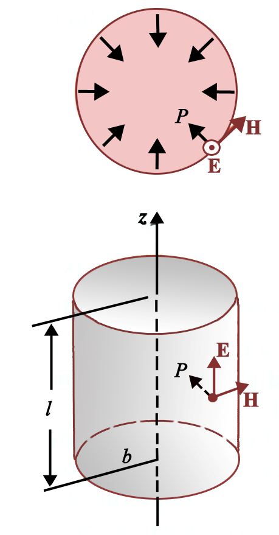
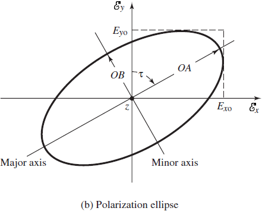
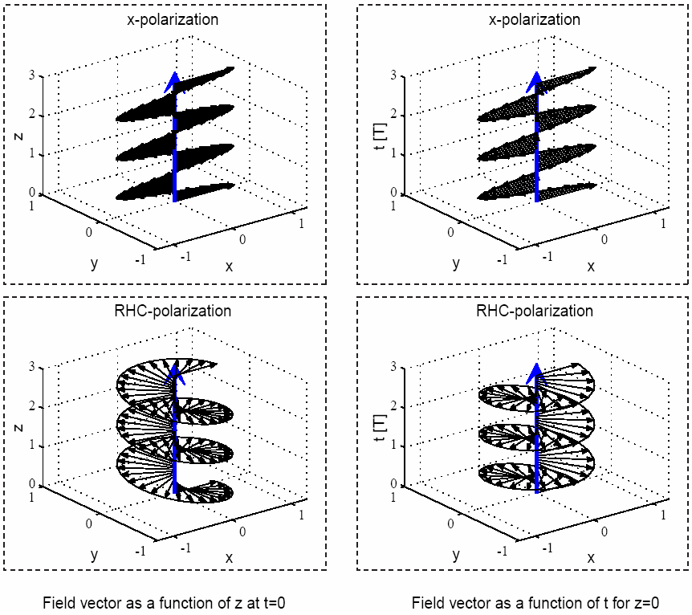
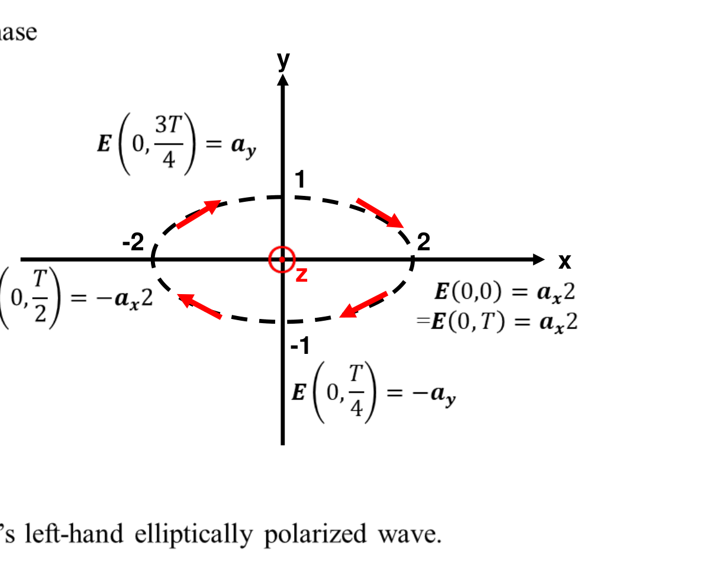
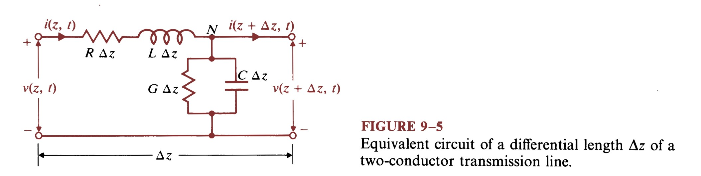
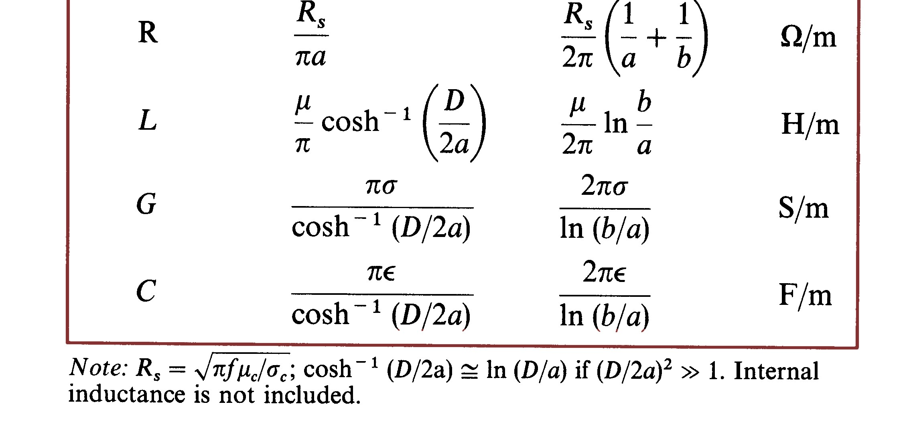
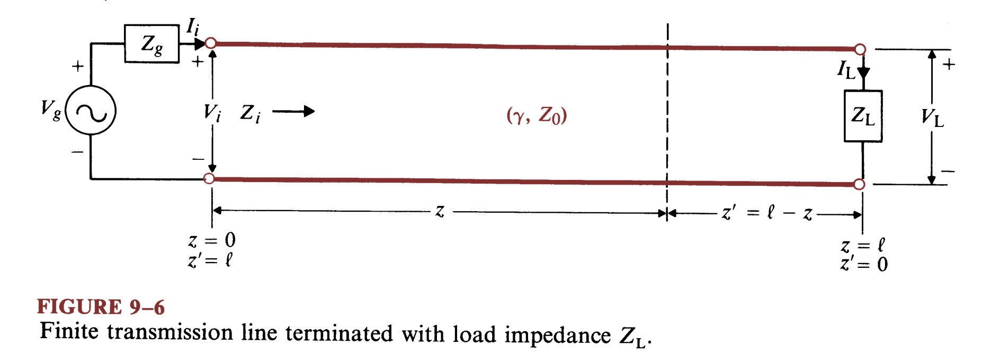
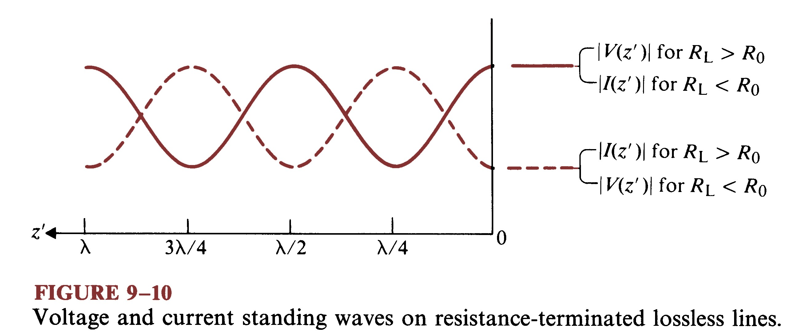
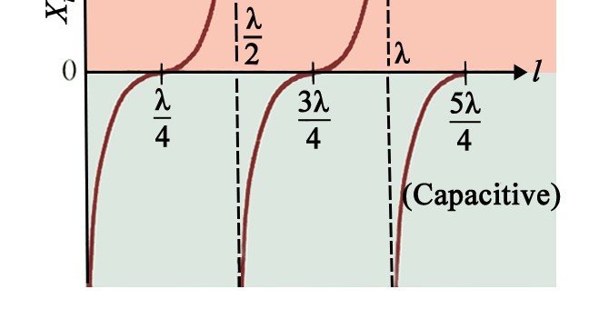
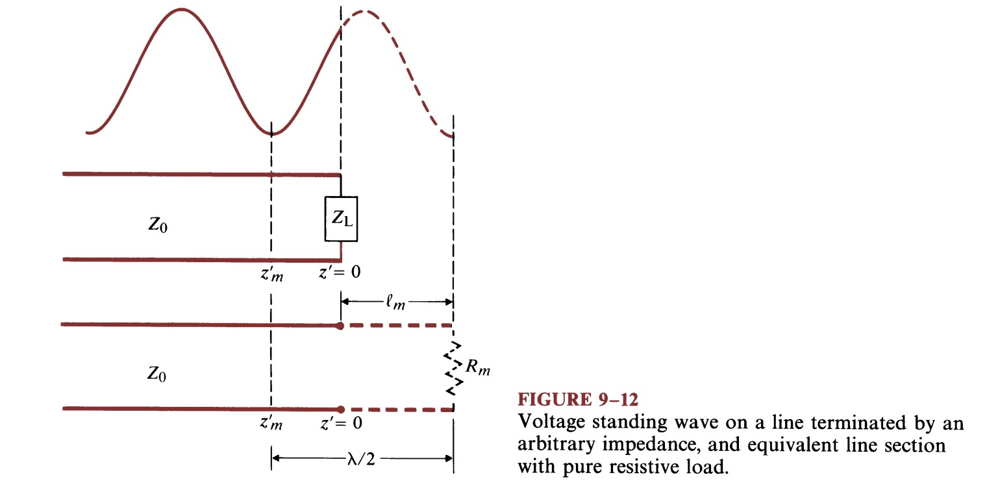

# 電磁學 CH8–CH9 複習講義（完整詳解）

> **範圍**：CH8 平面電磁波（Plane Electromagnetic Waves）、CH9 傳輸線（Transmission Lines）
> **整合教材**：`CHAPTER8_Plane_EM_Waves.pdf`（178 頁講義）、`CHAPTER9_Transmission_Lines(1).pdf`（113 頁講義）、`2026電磁學題庫_Exam 4_v2.pdf`（24 題＋官方解答）
> 圖片取自上述三份 PDF，存於 `images/lec/`。

---

## 📑 如何使用這份講義

1. 先看下方 **「題型頻率排行榜」**，決定優先複習哪些題型。
2. 每章先讀 **「觀念整理」**（含關鍵圖與公式），建立框架。
3. 再做 **「題型詳解」**：每題都有完整題目敘述、逐步解題、答案與出處。
4. 考前用最後的 **「速查公式表」** 與 **「題目覆蓋索引」** 做最後檢查。

### 答案出處標示慣例（請務必分辨）

| 標記 | 意義 |
|---|---|
| ✅ **答案（解答卷）** | 直接取自題庫 PDF 所附的官方解答頁，可信度最高 |
| 🧮 **答案（自行推導）** | 解答頁未明列、由本講義補上的推導步驟（觀念正確但請對照課本） |
| ⚠️ **存疑** | 推導出來但有疑慮處，已標明不確定點 |

> 本題庫每題都附官方解答頁，故數值答案皆為 ✅ 解答卷；**中間的逐步說明文字**多為本講義為了「讓你看懂方法」而補寫的中文推導。

---

## 🏆 題型頻率排行榜（依題庫出現題數排序）

> 本題庫為單份綜合考卷（非多年份），因此「頻率」代表**該題型在 24 題中佔的題數＝考試比重**。星級＝重要度。

| 排名 | 題型 | 題數 | 出現題號 | 講義對應 |
|---|---|---|---|---|
| 1 | **損耗介質波參數（α,β,η,δ,u_p）＋公式推導** ⭐⭐⭐ | 4 | P.8-9, P.8-11, P.8-13, Ex.8-4 | CH8 §損耗介質 |
| 2 | **駐波比 SWR ↔ 負載阻抗** ⭐⭐⭐ | 3 | Ex.9-8, Ex.9-9, Ex.9-10 | CH9 §駐波 |
| 3 | **極化（線性/圓/橢圓）** ⭐⭐⭐ | 2 | P.8-6, P.8-8 | CH8 §極化 |
| 4 | **Poynting 向量與功率流** ⭐⭐ | 2 | P.8-17, P.8-19 | CH8 §功率 |
| 5 | **Maxwell→波動方程推導** ⭐⭐ | 2 | P.8-1, P.8-4 | CH8 §波動方程 |
| 6 | **無失真線 distortionless** ⭐⭐ | 2 | R.9-16, Ex.9-3 | CH9 §無失真線 |
| 7 | **有限長線輸入阻抗/開短路** ⭐⭐ | 2 | R.9-22, Ex.9-6 | CH9 §輸入阻抗 |
| 8 | **無損耗介質平面波（瞬時式）** ⭐⭐ | 1 | Ex.8-1 | CH8 §無損耗介質 |
| 9 | **正向入射導體邊界** ⭐⭐ | 1 | P.8-20 | CH8 §正向入射 |
| 10 | **傳輸線方程與一般解（含直流）** ⭐⭐ | 1 | P.9-14 | CH9 §傳輸線方程 |
| 11 | **由量測反推 R,L,G,C（低損耗）** ⭐ | 1 | P.9-9 | CH9 §傳輸線方程 |
| 12 | **匹配負載的功率傳輸** ⭐ | 1 | Ex.9-5 | CH9 §有限長線 |
| 13 | **四分之一波長變壓器** ⭐ | 1 | R.9-26 | CH9 §阻抗匹配 |
| 14 | **線↔損耗介質的類比** ⭐ | 1 | Ex.9-2 | CH9 §傳輸線方程 |

**一句話策略**：CH8 把「損耗介質公式表＋極化判別」練熟；CH9 把「輸入阻抗公式 + 駐波比反推負載」練熟，就能掌握整份考卷約 70% 的分數。

---
---

# 📘 CH8　平面電磁波　觀念整理

## 8-0 全章地圖

平面波 = Maxwell 方程在「無源區」、且場量只隨**一個空間方向**變化的解。學習主線：

```
無損耗介質 ──→ 損耗介質 ──→ 功率(Poynting) ──→ 極化 ──→ 邊界入射
 (k,η,u)      (α,β,δ,η_c)      P=E×H          線/圓/橢圓     正向/斜向
```

## 8-1 無損耗介質中的均勻平面波

對 +z 方向傳播、$E = a_x E_x$ 的均勻平面波，亥姆霍茲方程 $\dfrac{d^2E_x}{dz^2}+k^2E_x=0$ 的解為行進波。重點公式：

| 量 | 公式 | 說明 |
|---|---|---|
| 波數 | $k=\omega\sqrt{\mu\varepsilon}=\dfrac{\omega}{u}$ | 相位隨距離變化率 |
| 相速 | $u_p=\dfrac{1}{\sqrt{\mu\varepsilon}}=\dfrac{c}{\sqrt{\mu_r\varepsilon_r}}$ | 無損耗⇒與頻率無關 |
| 波長 | $\lambda=\dfrac{2\pi}{k}=\dfrac{u_p}{f}$ | |
| 本質阻抗 | $\eta=\sqrt{\dfrac{\mu}{\varepsilon}}=\dfrac{\eta_0}{\sqrt{\varepsilon_r}}$（非磁性） | $\eta_0=120\pi\approx377\,\Omega$ |
| E–H 關係 | $\mathbf H=\dfrac1\eta\,\mathbf a_k\times\mathbf E$ | $a_k$＝傳播方向單位向量 |

> **背一個就好**：$\mathbf H=\frac1\eta\,\mathbf a_k\times\mathbf E$。知道 E 的方向與傳播方向，H 自動定出來（右手）。

## 8-2 損耗介質中的平面波（全章最常考）

損耗介質用**複數介電常數** $\varepsilon_c=\varepsilon'-j\varepsilon''=\varepsilon-j\dfrac{\sigma}{\omega}$，傳播常數變複數：

$$\gamma=\alpha+j\beta=j\omega\sqrt{\mu\varepsilon_c}=j\omega\sqrt{\mu\varepsilon\left(1-j\dfrac{\sigma}{\omega\varepsilon}\right)}$$

- $\alpha$＝**衰減常數**（Np/m），場量隨 $e^{-\alpha z}$ 衰減
- $\beta$＝**相位常數**（rad/m）
- **損耗正切** $\tan\delta_c=\dfrac{\varepsilon''}{\varepsilon'}=\dfrac{\sigma}{\omega\varepsilon}$ ←判斷介質「好壞」的關鍵

**判別三分類（先算 $\dfrac{\sigma}{\omega\varepsilon}$）：**

| 類型 | 條件 | α | β | η_c |
|---|---|---|---|---|
| 低損耗介電質 | $\dfrac{\sigma}{\omega\varepsilon}\ll1$ | $\dfrac{\sigma}{2}\sqrt{\dfrac{\mu}{\varepsilon}}=\dfrac{\omega\varepsilon''}{2}\sqrt{\dfrac{\mu}{\varepsilon'}}$ | $\omega\sqrt{\mu\varepsilon}\left[1+\frac18\!\left(\frac{\varepsilon''}{\varepsilon'}\right)^2\right]$ | $\sqrt{\dfrac{\mu}{\varepsilon'}}\!\left(1+j\dfrac{\varepsilon''}{2\varepsilon'}\right)$ |
| 良導體 | $\dfrac{\sigma}{\omega\varepsilon}\gg1$ | $\sqrt{\pi f\mu\sigma}$ | $\sqrt{\pi f\mu\sigma}$（=α） | $(1+j)\sqrt{\dfrac{\pi f\mu}{\sigma}}=\sqrt{\dfrac{\omega\mu}{\sigma}}e^{j\pi/4}$ |
| 一般 | 都不滿足 | 用 $\alpha=\omega\sqrt{\frac{\mu\varepsilon}{2}}\!\left[\sqrt{1+(\frac{\sigma}{\omega\varepsilon})^2}-1\right]^{1/2}$ | $\beta=\omega\sqrt{\frac{\mu\varepsilon}{2}}\!\left[\sqrt{1+(\frac{\sigma}{\omega\varepsilon})^2}+1\right]^{1/2}$ | $\sqrt{\mu/\varepsilon_c}$ |

**趨膚深度（skin depth）**：場量衰減到 $e^{-1}=36.8\%$ 的距離
$$\delta=\dfrac{1}{\alpha}\quad(\text{良導體}:\ \delta=\dfrac{1}{\sqrt{\pi f\mu\sigma}})$$

> **解題流程（損耗題必走）**：① 算 $\dfrac{\sigma}{\omega\varepsilon}$ 判類型 → ② 套對應 α,β,η_c → ③ 再求 δ, u_p, λ, 與瞬時式。

## 8-3 功率流：Poynting 向量

$$\boxed{\mathbf P=\mathbf E\times\mathbf H\ \text{(W/m}^2)}\qquad \mathbf P_{av}=\tfrac12\,\mathrm{Re}\!\left[\mathbf E\times\mathbf H^*\right]$$

方向＝功率流動方向（即傳播方向 $a_k$）。下圖為**同軸線內功率流**：E 沿徑向、H 沿圓周，$\mathbf P=\mathbf E\times\mathbf H$ 沿軸向 z —— 功率其實在「導體之間的介電質」流動（P.8-19 的核心圖）。



## 8-4 極化（Polarization）

看 $z=0$ 處 E 向量端點隨時間在 x–y 平面畫出的軌跡。設 $E_x=E_{10}\cos\omega t,\ E_y=E_{20}\cos(\omega t+\delta)$：

| 軌跡 | 條件 |
|---|---|
| **線性** | $\delta=0$ 或 $\pi$（兩分量同相/反相） |
| **圓** | $E_{10}=E_{20}$ 且 $\delta=\pm90°$ |
| **橢圓** | 其餘情形（含 $E_{10}\ne E_{20}$ 且 $\delta=\pm90°$） |

旋向（面向波「來向」看，即沿 −z 看）：$E_y$ **超前** $E_x$ 90° → 左旋（LH）；落後 → 右旋（RH）。





> 上圖右下「RHC」像螺旋：圓極化是「振幅不變、方向旋轉」；線性極化是「方向不變、振幅振盪」。

## 8-5 正向入射於導體邊界

平面波垂直打到良導體（如海水）表面：導體內部場量以 $e^{-\alpha z}$ 快速衰減（趨膚效應），導體可視為把波「吸收／反射」。入射波在導體內：$\mathbf H=a_y H_0 e^{-\alpha z}\cos(\omega t-\beta z)$，$\mathbf E=\eta_c\mathbf H\times a_z$，其中良導體 $\eta_c=\sqrt{\frac{\omega\mu}{\sigma}}e^{j\pi/4}$（E 超前 H 45°）。單位面積進入導體的平均功率＝表面 Poynting 向量（見 P.8-20）。

---

# 📝 CH8　題型詳解

---

## 題型 D1：由 Maxwell 方程導出波動方程　⭐⭐
**📊 出現：P.8-1** ｜ 講義對應：CH8 §8-2

### 完整題目（P.8-1）
寫出 Maxwell 方程，並導出無源導電介質（參數 $\varepsilon,\mu,\sigma$）中 **E** 與 **H** 的波動方程。
（提示：$\nabla\times(\nabla\times\mathbf A)=\nabla(\nabla\cdot\mathbf A)-\nabla^2\mathbf A$）

### 詳細解題
**Step 1．無源導電介質中的 Maxwell 旋度方程**（$\rho=0$，$\mathbf J_s=0$，傳導電流 $\mathbf J_c=\sigma\mathbf E$）：

$$\nabla\times\mathbf E=-\mu\dfrac{\partial\mathbf H}{\partial t}\quad①\qquad
\nabla\times\mathbf H=\mathbf J+\dfrac{\partial\mathbf D}{\partial t}=\sigma\mathbf E+\varepsilon\dfrac{\partial\mathbf E}{\partial t}\quad②$$

**Step 2．對 ① 取旋度**，代入提示恆等式（無源 $\nabla\cdot\mathbf E=0$）：

$$\nabla\times(\nabla\times\mathbf E)=\nabla(\underbrace{\nabla\cdot\mathbf E}_{0})-\nabla^2\mathbf E=-\nabla^2\mathbf E$$

而 $\nabla\times(\nabla\times\mathbf E)=-\mu\dfrac{\partial}{\partial t}(\nabla\times\mathbf H)=-\mu\dfrac{\partial}{\partial t}\!\left(\sigma\mathbf E+\varepsilon\dfrac{\partial\mathbf E}{\partial t}\right)$

**Step 3．整理得 E 的波動方程**（對 H 同法可得）：

$$\boxed{\ \nabla^2\mathbf E=\mu\sigma\dfrac{\partial\mathbf E}{\partial t}+\mu\varepsilon\dfrac{\partial^2\mathbf E}{\partial t^2}\ }\qquad
\boxed{\ \nabla^2\mathbf H=\mu\sigma\dfrac{\partial\mathbf H}{\partial t}+\mu\varepsilon\dfrac{\partial^2\mathbf H}{\partial t^2}\ }$$

時諧（$e^{j\omega t}$）下化為 $\nabla^2\mathbf E=\gamma^2\mathbf E$，其中 $\gamma^2=j\omega\mu(\sigma+j\omega\varepsilon)$。

### 答案
✅ **答案（解答卷）**：如上方塊。中間多了「$\mu\sigma\,\partial\mathbf E/\partial t$」這項就是**損耗（傳導電流）造成衰減**的來源；$\sigma=0$ 時退化成無損耗的波方程。

### 跨題連結
此 $\gamma$ 就是後面 P.8-9 要解出 α、β 的對象；也與 CH9 傳輸線 $\gamma=\sqrt{(R+j\omega L)(G+j\omega C)}$ 完全類比（見 Ex.9-2）。

---

## 題型 D2：均勻平面波下 Maxwell 方程的化簡　⭐⭐
**📊 出現：P.8-4** ｜ 講義對應：CH8 §8-1

### 完整題目（P.8-4）
對在簡單介質中傳播的時諧均勻平面波，**E**、**H** 皆隨 $e^{-j\mathbf k\cdot\mathbf R}$ 變化。證明無源區四條 Maxwell 方程可化簡為下列形式（即把 $\nabla$ 換成 $-j\mathbf k$）。

### 詳細解題
令 $\mathbf E=\mathbf E_0 e^{-j\mathbf k\cdot\mathbf R}$、$\mathbf H=\mathbf H_0 e^{-j\mathbf k\cdot\mathbf R}$。關鍵運算：

$$\nabla\!\left(e^{-j\mathbf k\cdot\mathbf R}\right)=-j\mathbf k\,e^{-j\mathbf k\cdot\mathbf R}\ \Rightarrow\ \nabla\to-j\mathbf k$$

代入四條方程（$\nabla\times\mathbf E_0=0$、$\mathbf J=0$）：

$$\nabla\times\mathbf E=-j\mathbf k\times\mathbf E=-j\omega\mu\mathbf H\ \Rightarrow\ \boxed{\mathbf k\times\mathbf E=\omega\mu\mathbf H}$$
$$\nabla\times\mathbf H=-j\mathbf k\times\mathbf H=j\omega\varepsilon\mathbf E\ \Rightarrow\ \boxed{\mathbf k\times\mathbf H=-\omega\varepsilon\mathbf E}$$
$$\nabla\cdot\mathbf E=0\Rightarrow \mathbf k\cdot\mathbf E=0,\qquad \nabla\cdot\mathbf H=0\Rightarrow \mathbf k\cdot\mathbf H=0$$

### 答案
✅ **答案（解答卷）**：$\mathbf k\times\mathbf E=\omega\mu\mathbf H$、$\mathbf k\times\mathbf H=-\omega\varepsilon\mathbf E$、$\mathbf k\cdot\mathbf E=\mathbf k\cdot\mathbf H=0$。

**物理意義**：E、H、k **三者互相垂直**（橫波 TEM）；且由前兩式相除得 $|\mathbf E|/|\mathbf H|=\sqrt{\mu/\varepsilon}=\eta$。這就是「$\mathbf H=\frac1\eta a_k\times\mathbf E$」的來源。

---

## 題型 C1：給定 E 求頻率/介電常數/極化/H　⭐⭐⭐
**📊 出現：P.8-6** ｜ 講義對應：CH8 §8-1、§8-4

### 完整題目（P.8-6）
時諧均勻平面波在介電質中的電場為
$$\mathbf E(z,t)=\mathbf a_x\,2\cos\!\left(10^8t-\tfrac{z}{\sqrt3}\right)-\mathbf a_y\sin\!\left(10^8t-\tfrac{z}{\sqrt3}\right)\ \text{(V/m)}$$
(a) 求頻率與波長；(b) 介電常數；(c) 詳述極化；(d) 求對應 H 場。

### 詳細解題
讀出參數：$\omega=10^8$ rad/s，$k=\dfrac{1}{\sqrt3}$ rad/m，傳播 +z。

**(a) 頻率與波長**
$$f=\dfrac{\omega}{2\pi}=\dfrac{10^8}{2\pi}\approx1.59\times10^7\ \text{Hz}$$
$$\lambda=\dfrac{2\pi}{k}=2\pi\sqrt3\approx10.88\ \text{m}$$

**(b) 介電常數**：由 $k=\omega\sqrt{\mu_0\varepsilon_0\varepsilon_r}=\dfrac{\omega}{c}\sqrt{\varepsilon_r}$
$$\dfrac{1}{\sqrt3}=\dfrac{10^8}{3\times10^8}\sqrt{\varepsilon_r}=\dfrac13\sqrt{\varepsilon_r}\ \Rightarrow\ \sqrt{\varepsilon_r}=\sqrt3\ \Rightarrow\ \boxed{\varepsilon_r=3}$$

**(c) 極化**：在 $z=0$，$E_x=2\cos(10^8t)$，$E_y=-\sin(10^8t)$。消去時間：
$$\dfrac{E_x^2}{2^2}+\dfrac{E_y^2}{(-1)^2}=\cos^2+\sin^2=1$$
是橢圓且 $E_{10}=2\ne E_{20}=1$ → **橢圓極化**。再看旋向：$E_y$ 比 $E_x$ 超前 90°（時間相位），逐點描軌跡（下圖）為**順時針**（沿 +z 看）⇒ **左旋橢圓極化（LHEP）**。



**(d) H 場**：傳播 +z，$\eta=\dfrac{\eta_0}{\sqrt3}$，用 $\mathbf H=\dfrac1\eta\,\mathbf a_z\times\mathbf E$：
$$\mathbf H=\dfrac{\sqrt3}{\eta_0}\,\mathbf a_z\times\mathbf E
=\dfrac{\sqrt3}{\eta_0}\Big[\mathbf a_x\sin\!\big(10^8t-\tfrac{z}{\sqrt3}\big)+\mathbf a_y\,2\cos\!\big(10^8t-\tfrac{z}{\sqrt3}\big)\Big]\ \text{(A/m)}$$

### 答案
✅ **答案（解答卷）**
- (a) $f\approx1.59\times10^7$ Hz，$\lambda=2\pi\sqrt3\approx10.88$ m
- (b) $\varepsilon_r=3$
- (c) **左旋橢圓極化**（$E_{10}=2,E_{20}=1$，$E_y$ 超前 $E_x$ 90°）
- (d) $\mathbf H=\dfrac{\sqrt3}{\eta_0}[\mathbf a_x\sin(\cdot)+\mathbf a_y 2\cos(\cdot)]$ A/m，$(\cdot)=10^8t-z/\sqrt3$

### 跨題連結
極化判別法與 P.8-8 互補；$\eta=\eta_0/\sqrt{\varepsilon_r}$ 與 Ex.8-1 相同套路。

---

## 題型 C2：橢圓極化 ↔ 圓極化的分解　⭐⭐⭐
**📊 出現：P.8-8** ｜ 講義對應：CH8 §8-4

### 完整題目（P.8-8）
證明：(a) 橢圓極化平面波可分解為右旋(RHCP)與左旋(LHCP)圓極化波之和；(b) 圓極化波可由兩個方向相反的橢圓極化波疊加得到。

### 詳細解題（相量法，省略 $e^{-jkz}$）
**(a)** 橢圓極化相量：$\mathbf E=\mathbf a_x E_1+\mathbf a_y E_2$（$E_1\ne E_2$，可為複數）。定義
$$\mathbf E_{rc}=E_{rc}(\mathbf a_x-j\mathbf a_y),\ \ E_{rc}=\tfrac12(E_1+jE_2)\quad(\text{右旋})$$
$$\mathbf E_{lc}=E_{lc}(\mathbf a_x+j\mathbf a_y),\ \ E_{lc}=\tfrac12(E_1-jE_2)\quad(\text{左旋})$$
相加：
$$\mathbf E_{rc}+\mathbf E_{lc}=\tfrac12(E_1+jE_2)(\mathbf a_x-j\mathbf a_y)+\tfrac12(E_1-jE_2)(\mathbf a_x+j\mathbf a_y)=\mathbf a_xE_1+\mathbf a_yE_2=\mathbf E\ \checkmark$$

**(b)** 反向操作：把一個 RHEP 與一個 LHEP（方向相反、長短軸互換）相加，交叉項抵消後 $E_{10}=E_{20}$ 即得圓極化。即(a)的逆敘述。

### 答案
✅ **答案（解答卷）**：任一橢圓極化 = RHCP + LHCP（係數如上）。此為「圓極化基底」展開，與傅立葉「任意向量可用兩個正交基底表示」同理。

---

## 題型 A0：導出導電介質的 α 與 β（公式來源）　⭐⭐
**📊 出現：P.8-9** ｜ 講義對應：CH8 §8-2

### 完整題目（P.8-9）
導出導電介質中衰減常數 α 與相位常數 β 的一般式。

### 詳細解題
傳播常數 $\gamma=\alpha+j\beta=j\omega\sqrt{\mu\varepsilon\left(1-j\frac{\sigma}{\omega\varepsilon}\right)}$。把 $-\gamma^2$ 拆實部、模長兩式：

$$-\gamma^2=\beta^2-\alpha^2-2j\alpha\beta=\omega^2\mu\varepsilon\left(1-j\tfrac{\sigma}{\omega\varepsilon}\right)$$
$$\Rightarrow\ \beta^2-\alpha^2=\mathrm{Re}(-\gamma^2)=\omega^2\mu\varepsilon\quad(1)$$
$$\Rightarrow\ \beta^2+\alpha^2=|-\gamma^2|=\omega^2\mu\varepsilon\sqrt{1+\left(\tfrac{\sigma}{\omega\varepsilon}\right)^2}\quad(2)$$

(2)−(1) 與 (2)+(1) 各除 2 再開根：

$$\boxed{\ \alpha=\omega\sqrt{\dfrac{\mu\varepsilon}{2}}\left[\sqrt{1+\left(\tfrac{\sigma}{\omega\varepsilon}\right)^2}-1\right]^{1/2}\ }\qquad
\boxed{\ \beta=\omega\sqrt{\dfrac{\mu\varepsilon}{2}}\left[\sqrt{1+\left(\tfrac{\sigma}{\omega\varepsilon}\right)^2}+1\right]^{1/2}\ }$$

### 答案
✅ **答案（解答卷）**：如上。**這兩式是 CH8 損耗題的母公式**；$\frac{\sigma}{\omega\varepsilon}\ll1$ 或 $\gg1$ 時就退化成觀念表中的「低損耗／良導體」近似。

---

## 題型 A1：低損耗介電質的波參數　⭐⭐⭐
**📊 出現：P.8-11** ｜ 講義對應：CH8 §8-2

### 完整題目（P.8-11）
3 GHz、y 極化均勻平面波在非磁性介質（$\varepsilon_r=2.5$、損耗正切 $10^{-2}$）中沿 +x 傳播。
(a) 求振幅衰減一半的距離；(b) 求本質阻抗、波長、相速、群速；(c) 若 $x=0$ 處 $\mathbf E=\mathbf a_y50\sin(6\pi\times10^9t+\pi/3)$ V/m，寫出 H 的瞬時式。

### 詳細解題
判類型：$\tan\delta_c=\frac{\sigma}{\omega\varepsilon}=10^{-2}\ll1$ → **低損耗介電質**。$\omega=2\pi\times3\times10^9$，$c=3\times10^8$。

**(a)** 衰減常數（低損耗式）：
$$\alpha=\dfrac{\omega}{2}\left(\dfrac{\varepsilon''}{\varepsilon'}\right)\dfrac{\sqrt{\varepsilon_r}}{c}=\dfrac{2\pi\times3\times10^9}{2}\times10^{-2}\times\dfrac{\sqrt{2.5}}{3\times10^8}=0.497\ \text{Np/m}$$
振幅減半：$e^{-\alpha x}=\tfrac12\Rightarrow x=\dfrac{\ln2}{\alpha}=\boxed{1.395\ \text{m}}$

**(b)**
$$\eta_c=\dfrac{1}{\sqrt{\varepsilon_r}}\sqrt{\tfrac{\mu_0}{\varepsilon_0}}\Big(1+j\tfrac{\varepsilon''}{2\varepsilon'}\Big)=\dfrac{120\pi}{\sqrt{2.5}}(1+j0.005)=238\,e^{j0.0016\pi}\ \Omega$$
$$\beta=\omega\dfrac{\sqrt{\varepsilon_r}}{c}\Big[1+\tfrac18(10^{-2})^2\Big]=31.6\pi\ \text{rad/m}$$
$$\lambda=\dfrac{2\pi}{\beta}=0.063\ \text{m},\quad u_p=\dfrac{\omega}{\beta}=1.899\times10^8\ \text{m/s},\quad u_g=\dfrac{1}{d\beta/d\omega}=1.897\times10^8\ \text{m/s}$$

**(c)** 先把 sin 轉 cos：$\sin(\theta+\tfrac\pi3)=\cos(\theta+\tfrac\pi3-\tfrac\pi2)=\cos(\theta-\tfrac\pi6)$。$\mathbf H=\dfrac1{\eta_c}\mathbf a_x\times\mathbf E$，沿 +x 傳播 ⇒ H 在 +z：
$$\mathbf H(x,t)=\mathbf a_z\,0.21\,e^{-0.497x}\cos\!\big(6\pi\times10^9t-31.6\pi x-0.168\pi\big)\ \text{(A/m)}$$
（$0.21=50/238$；相位多 $-0.0016\pi$ 來自 $\eta_c$ 的輻角，併入 $-\pi/6-0.0016\pi=-0.168\pi$。）

### 答案
✅ **答案（解答卷）**
- (a) $\alpha=0.497$ Np/m，減半距離 $=1.395$ m
- (b) $\eta_c=238\,e^{j0.0016\pi}\,\Omega$，$\lambda=0.063$ m，$u_p=1.899\times10^8$ m/s，$u_g=1.897\times10^8$ m/s
- (c) $\mathbf H=\mathbf a_z0.21e^{-0.497x}\cos(6\pi\times10^9t-31.6\pi x-0.168\pi)$ A/m

---

## 題型 A2：良導體的趨膚深度與衰減　⭐⭐⭐
**📊 出現：P.8-13** ｜ 講義對應：CH8 §8-2

### 完整題目（P.8-13）
已知石墨在 100 MHz 的趨膚深度為 0.16 mm。求 (a) 石墨的導電率；(b) 1 GHz 波在石墨中行進使場強衰減 30 dB 的距離。

### 詳細解題
**(a)** 良導體 $\delta=\dfrac{1}{\sqrt{\pi f\mu\sigma}}$，反解 σ（$f=10^8$，$\mu=\mu_0$）：
$$\sigma=\dfrac{1}{\pi f\mu\delta^2}=\dfrac{1}{\pi\times10^8\times4\pi\times10^{-7}\times(0.16\times10^{-3})^2}\approx\boxed{0.99\times10^5\ \text{S/m}}$$

**(b)** 1 GHz 的衰減常數：
$$\alpha=\sqrt{\pi f\mu\sigma}=\sqrt{\pi\times10^9\times4\pi\times10^{-7}\times0.99\times10^5}\approx1.98\times10^4\ \text{Np/m}$$
30 dB：$20\log e^{-\alpha z}=-30\Rightarrow e^{-\alpha z}=10^{-3/2}$
$$z=\dfrac{\tfrac32\ln10}{\alpha}=\dfrac{3.45}{1.98\times10^4}\approx1.75\times10^{-4}\ \text{m}=\boxed{0.175\ \text{mm}}$$

### 答案
✅ **答案（解答卷）**：(a) $\sigma\approx0.99\times10^5$ S/m；(b) $z\approx0.175$ mm。

> **單位換算要記**：$1\,\text{Np}=8.686\,\text{dB}$；衰減 N dB ⇒ $e^{-\alpha z}=10^{-N/20}$（場強）。

---

## 題型 E1：圓極化波的瞬時 Poynting 為定值　⭐⭐
**📊 出現：P.8-17** ｜ 講義對應：CH8 §8-3、§8-4

### 完整題目（P.8-17）
證明在無損耗介質中傳播的圓極化平面波，其**瞬時** Poynting 向量為與時間、距離無關的定值。
（提示：$\mathbf E=E_0(\mathbf a_x\cos\omega t+\mathbf a_y\sin\omega t)$）

### 詳細解題
$\mathbf H=\dfrac1\eta\mathbf a_z\times\mathbf E=\dfrac{E_0}{\eta}(-\mathbf a_x\sin\omega t+\mathbf a_y\cos\omega t)$。
$$\mathbf P=\mathbf E\times\mathbf H=\mathbf a_z\dfrac{E_0^2}{\eta}\big(\cos^2\omega t+\sin^2\omega t\big)=\boxed{\mathbf a_z\dfrac{E_0^2}{\eta}}$$

### 答案
✅ **答案（解答卷）**：$\mathbf P=\mathbf a_z\dfrac{E_0^2}{\eta}$＝常數，與 $t$、$z$ 無關。

**物理意義**：圓極化波的能量流是「平穩」的（不像線性極化會隨 $\cos^2$ 脈動）。

---

## 題型 E2：同軸線功率＝V₀I（Poynting 積分）　⭐⭐
**📊 出現：P.8-19** ｜ 講義對應：CH8 §8-3

### 完整題目（P.8-19）
從電磁學觀點，無損耗同軸電纜傳輸的功率可用介電質內的 Poynting 向量表示。設內導體（半徑 a）與外導體（內徑 b）間加直流電壓 $V_0$、流過電流 $I$ 到負載。證明 Poynting 向量對截面積的積分等於傳到負載的功率 $V_0I$。

### 詳細解題
**靜電場（高斯定律）**：$\mathbf E=\mathbf a_r\dfrac{\rho_\ell}{2\pi\varepsilon r}$，由 $V_0=-\int_b^a E\,dr=\dfrac{\rho_\ell}{2\pi\varepsilon}\ln\dfrac ba$ 得 $\rho_\ell=\dfrac{2\pi\varepsilon V_0}{\ln(b/a)}$，故
$$\mathbf E=\mathbf a_r\dfrac{V_0}{r\ln(b/a)}$$
**靜磁場（安培定律）**：$\mathbf H=\mathbf a_\phi\dfrac{I}{2\pi r}$。

**Poynting 向量**：
$$\mathbf P=\mathbf E\times\mathbf H=\mathbf a_z\dfrac{V_0I}{2\pi r^2\ln(b/a)}$$
**對截面積（a→b）積分**：
$$P=\int_0^{2\pi}\!\!\int_a^b\dfrac{V_0I}{2\pi r^2\ln(b/a)}\,r\,dr\,d\phi=\dfrac{V_0I}{\ln(b/a)}\int_a^b\dfrac{dr}{r}=\dfrac{V_0I}{\ln(b/a)}\ln\dfrac ba=\boxed{V_0I}$$

### 答案
✅ **答案（解答卷）**：$\displaystyle\oint_s\mathbf P\cdot d\mathbf s=V_0I$。功率是「在導體之間的場」中傳遞的，不是在金屬裡 —— 這是 Poynting 觀點的精髓。

---

## 題型 B1：無損耗介質平面波的瞬時式　⭐⭐
**📊 出現：Ex.8-1** ｜ 講義對應：CH8 §8-1

### 完整題目（Ex.8-1）
均勻平面波 $\mathbf E=\mathbf a_xE_x$ 在無損耗介質（$\varepsilon_r=4,\mu_r=1,\sigma=0$）中沿 +z 傳播。$E_x$ 為 100 MHz 正弦，於 $t=0,z=\tfrac18$ m 時達最大值 $+10^{-4}$ V/m。
(a) 寫 E 的瞬時式；(b) 寫 H 的瞬時式；(c) 求 $t=10^{-8}$ s 時 $E_x$ 為正最大值的位置。

### 詳細解題
$\omega=2\pi\times10^8$，$k=\omega\sqrt{\mu_r\varepsilon_r}/c=\dfrac{2\pi\times10^8\sqrt4}{3\times10^8}=\dfrac{4\pi}{3}$ rad/m。

**(a)** 設 $E_x=10^{-4}\cos(2\pi10^8t-kz+\psi)$。在 $t=0,z=\tfrac18$ 為最大 ⇒ 餘弦引數＝0：
$$\psi=kz=\dfrac{4\pi}{3}\cdot\dfrac18=\dfrac\pi6$$
$$\boxed{\mathbf E(z,t)=\mathbf a_x10^{-4}\cos\!\Big(2\pi10^8t-\tfrac{4\pi}{3}\big(z-\tfrac18\big)\Big)\ \text{V/m}}$$

**(b)** $\eta=\dfrac{\eta_0}{\sqrt{\varepsilon_r}}=\dfrac{120\pi}{2}=60\pi\,\Omega$，$\mathbf H=\mathbf a_y\dfrac{E_x}{\eta}$：
$$\boxed{\mathbf H(z,t)=\mathbf a_y\dfrac{10^{-4}}{60\pi}\cos\!\Big(2\pi10^8t-\tfrac{4\pi}{3}\big(z-\tfrac18\big)\Big)\ \text{A/m}}$$

**(c)** $t=10^{-8}$ s，令引數 $=\pm2n\pi$：
$$2\pi10^8(10^{-8})-\tfrac{4\pi}{3}\big(z_m-\tfrac18\big)=\pm2n\pi\ \Rightarrow\ z_m=\dfrac{13}{8}\pm\dfrac32n\ \text{(m)},\ n=0,1,2,\dots$$
（$\lambda=2\pi/k=\tfrac32$ m，故 $z_m=\tfrac{13}{8}\pm n\lambda$。）

### 答案
✅ **答案（解答卷）**
- (a) $\mathbf E=\mathbf a_x10^{-4}\cos\big(2\pi10^8t-\tfrac{4\pi}{3}(z-\tfrac18)\big)$ V/m
- (b) $\mathbf H=\mathbf a_y\dfrac{10^{-4}}{60\pi}\cos(\cdot)$ A/m
- (c) $z_m=\tfrac{13}{8}\pm n\lambda$ m（$\lambda=\tfrac32$ m）

---

## 題型 A3：海水（良導體）的完整波參數　⭐⭐⭐
**📊 出現：Ex.8-4** ｜ 講義對應：CH8 §8-2

### 完整題目（Ex.8-4）
線性極化均勻平面波於海水中沿 +z 傳播，$z=0$ 處 $\mathbf E=\mathbf a_x100\cos(10^7\pi t)$ V/m。海水參數 $\varepsilon_r=72,\mu_r=1,\sigma=4$ S/m。
(a) 求 α、β、η、相速、波長、趨膚深度；(b) E 振幅衰減到 $z=0$ 值 1% 的距離；(c) 寫 $z=0.8$ m 處 $\mathbf E(z,t)$、$\mathbf H(z,t)$。

### 詳細解題
$\omega=10^7\pi$，$f=5\times10^6$ Hz。判類型：
$$\dfrac{\sigma}{\omega\varepsilon}=\dfrac{4}{10^7\pi\times72\times\frac{1}{36\pi}\times10^{-9}}=200\gg1\ \Rightarrow\ \textbf{良導體}$$

**(a)**
$$\alpha=\beta=\sqrt{\pi f\mu_0\sigma}=\sqrt{\pi\times5\times10^6\times4\pi\times10^{-7}\times4}=8.89\ (\text{Np/m, rad/m})$$
$$\eta_c=(1+j)\sqrt{\dfrac{\pi f\mu}{\sigma}}=\pi e^{j\pi/4}\ \Omega$$
$$u_p=\dfrac\omega\beta=\dfrac{10^7\pi}{8.89}=3.53\times10^6\ \text{m/s},\quad \lambda=\dfrac{2\pi}{\beta}=0.707\ \text{m},\quad \delta=\dfrac1\alpha=0.112\ \text{m}$$

**(b)** $e^{-\alpha z_1}=0.01\Rightarrow z_1=\dfrac{\ln100}{\alpha}=\dfrac{4.605}{8.89}=0.518$ m。

**(c)** 相量 $\mathbf E(z)=\mathbf a_x100e^{-\alpha z}e^{-j\beta z}$。在 $z=0.8$：相位 $\beta z=8.89\times0.8=7.11$ rad，振幅 $100e^{-0.8\times8.89}=0.082$：
$$\mathbf E(0.8,t)=\mathbf a_x0.082\cos(10^7\pi t-7.11)\ \text{V/m}$$
H 落後 E 45°、除以 $|\eta_c|=\pi$：$100e^{-0.8\alpha}/\pi=0.026$，相位再 $-\pi/4$：
$$\mathbf H(0.8,t)=\mathbf a_y0.026\cos(10^7\pi t-7.11-\tfrac\pi4)=\mathbf a_y0.026\cos(10^7\pi t-1.61)\ \text{A/m}$$
（$-7.11-0.785=-7.897$，加 $2\pi$ 得 $-1.61$。）

### 答案
✅ **答案（解答卷）**
- (a) $\alpha=\beta=8.89$；$\eta_c=\pi e^{j\pi/4}\,\Omega$；$u_p=3.53\times10^6$ m/s；$\lambda=0.707$ m；$\delta=0.112$ m
- (b) $z_1=0.518$ m
- (c) $\mathbf E=\mathbf a_x0.082\cos(10^7\pi t-7.11)$ V/m；$\mathbf H=\mathbf a_y0.026\cos(10^7\pi t-1.61)$ A/m

### 跨題連結
與 P.8-13 同為良導體公式；良導體 $\eta_c$ 輻角恆為 45°（E 超前 H 45°）是固定特徵，常作為陷阱。

---
---

# 📗 CH9　傳輸線　觀念整理

## 9-0 全章地圖

```
分布參數(R,L,G,C) ─→ 電報方程 ─→ 傳播常數γ、特性阻抗Z₀
        │                              │
   無損耗/無失真線               有限長線：反射係數Γ、輸入阻抗Z_in、駐波比S
                                        │
                              開/短路線、λ/4 變壓器、阻抗匹配
```

## 9-1 傳輸線方程（電報方程）與分布參數

把一小段 Δz 的線用 **R、L（串聯）+ G、C（並聯）** 等效電路表示（下圖 Fig 9-5）：



由 KVL/KCL 取極限得**電報方程**（時諧）：
$$-\dfrac{dV}{dz}=(R+j\omega L)I,\qquad -\dfrac{dI}{dz}=(G+j\omega C)V$$
合併成波動方程 $\dfrac{d^2V}{dz^2}=\gamma^2V$，其中：

$$\boxed{\gamma=\alpha+j\beta=\sqrt{(R+j\omega L)(G+j\omega C)}}\qquad
\boxed{Z_0=\sqrt{\dfrac{R+j\omega L}{G+j\omega C}}}$$

**雙導線與同軸線的 R,L,G,C 公式**（下表；$R_s=\sqrt{\pi f\mu_c/\sigma_c}$＝表面電阻）：



## 9-2 三種特例

| 線種 | 條件 | γ、Z₀ |
|---|---|---|
| **無損耗線** | $R=G=0$ | $\gamma=j\omega\sqrt{LC}$（$\alpha=0$），$Z_0=\sqrt{L/C}$（純實），$u_p=1/\sqrt{LC}$ |
| **低損耗線** | $R\ll\omega L,\ G\ll\omega C$ | $\alpha\approx\dfrac{R}{2Z_0}+\dfrac{GZ_0}{2}$，$\beta\approx\omega\sqrt{LC}$，$Z_0\approx\sqrt{L/C}$ |
| **無失真線** | $\dfrac{R}{L}=\dfrac{G}{C}$ | $\alpha=\sqrt{RG}$（與頻率無關！），$\beta=\omega\sqrt{LC}$，$Z_0=\sqrt{L/C}$ |

> **無失真線重點**：滿足 Heaviside 條件 $\frac RL=\frac GC$ 時，**各頻率分量同速傳播**，波形不失真（只衰減不變形）。

## 9-3 有限長線：反射、輸入阻抗、駐波

有限長線一端接信號源 $(V_g,Z_g)$，另一端接負載 $Z_L$（下圖 Fig 9-6）：



| 量 | 公式 |
|---|---|
| **負載反射係數** | $\Gamma_L=\dfrac{Z_L-Z_0}{Z_L+Z_0}$ |
| **距負載 z′ 處輸入阻抗** | $Z_{in}=Z_0\dfrac{Z_L+Z_0\tanh\gamma z'}{Z_0+Z_L\tanh\gamma z'}$（無損耗：$\tanh\to j\tan\beta z'$） |
| **駐波比 SWR** | $S=\dfrac{1+|\Gamma|}{1-|\Gamma|}\ \Leftrightarrow\ |\Gamma|=\dfrac{S-1}{S+1}$ |
| **電壓最大/最小** | $V_{max}=|V_0^+|(1+|\Gamma|)$，$V_{min}=|V_0^+|(1-|\Gamma|)$ |

**駐波圖**（Fig 9-10）：$R_L\ne R_0$ 時線上形成駐波，相鄰兩電壓最小值間距 $=\lambda/2$：



## 9-4 開路/短路線與 λ/4 變壓器

無損耗線：
$$Z_{in,oc}=-jZ_0\cot\beta l\quad(\text{開路}),\qquad Z_{in,sc}=jZ_0\tan\beta l\quad(\text{短路})$$
兩者皆為純電抗，隨長度 $l$ 在電感性/電容性間週期變化（下圖：開/短路線輸入電抗 vs 長度）：



**λ/4 阻抗變壓器**：在主線與**純電阻負載**間插入 $\lambda/4$ 線，取特性阻抗 $Z_t=\sqrt{Z_0Z_L}$，即可把 $Z_L$ 匹配到 $Z_0$（因 $Z_{in}=Z_t^2/Z_L=Z_0$）。

---

# 📝 CH9　題型詳解

---

## 題型 G1：傳輸線 ↔ 損耗介質平面波的類比　⭐
**📊 出現：Ex.9-2** ｜ 講義對應：CH9 §9-1

### 完整題目（Ex.9-2）
說明傳輸線上的波與損耗介質中均勻平面波之間的類比關係。

### 詳細解題
| | 傳輸線 | 損耗介質平面波 |
|---|---|---|
| 波動方程 | $\dfrac{d^2V}{dz^2}=\gamma^2V$ | $\dfrac{d^2E}{dz^2}=\gamma^2E$ |
| 傳播常數 | $\gamma=\sqrt{(R+j\omega L)(G+j\omega C)}$ | $\gamma=\sqrt{j\omega\mu(\sigma+j\omega\varepsilon)}$ |
| 串聯阻抗 ↔ 磁項 | $R+j\omega L$ | $j\omega\mu$ |
| 並聯導納 ↔ 電項 | $G+j\omega C$ | $\sigma+j\omega\varepsilon$ |
| 特性阻抗 ↔ 本質阻抗 | $Z_0=\sqrt{\dfrac{R+j\omega L}{G+j\omega C}}$ | $\eta=\sqrt{\dfrac{j\omega\mu}{\sigma+j\omega\varepsilon}}$ |

### 答案
✅ **答案（解答卷）**：兩者滿足**相同形式**的波動方程，對應關係如上表。記住「$R+j\omega L\leftrightarrow j\omega\mu$、$G+j\omega C\leftrightarrow\sigma+j\omega\varepsilon$」即可在兩套公式間互轉。

---

## 題型 H1：無失真線的定義與條件　⭐⭐
**📊 出現：R.9-16** ｜ 講義對應：CH9 §9-2

### 完整題目（R.9-16）
何謂「無失真線（distortionless line）」？分布參數需滿足什麼關係才能無失真？

### 詳細解題與答案
✅ **答案（解答卷）**
- **意義**：所有頻率分量以**相同相速**傳播，故信號波形被保留（可有衰減，但不變形）。
- **條件（Heaviside 條件）**：$\boxed{\dfrac RL=\dfrac GC}$
- **結果**：$\alpha=\sqrt{RG}$（**與頻率無關**），$\beta=\omega\sqrt{LC}$（**與頻率成正比**），$Z_0=\sqrt{L/C}$（純電阻）。
  因 α 不隨頻率變、β 線性於頻率 ⇒ 各頻率同衰減、同相速 ⇒ 不失真。

---

## 題型 H2：無失真線的 R,L,G 與衰減　⭐⭐
**📊 出現：Ex.9-3** ｜ 講義對應：CH9 §9-2

### 完整題目（Ex.9-3）
50 Ω 無失真線的衰減為 0.01 dB/m，電容 $C=0.1$ nF/m。
(a) 求每公尺的 R、L、G；(b) 波傳播速度；(c) 行進波振幅在 1 km、5 km 後各衰減到多少百分比。

### 詳細解題
無失真線：$\dfrac RL=\dfrac GC$、$Z_0=\sqrt{L/C}$、$\alpha=\sqrt{RG}$。先換 α：
$$\alpha=\dfrac{\ln10}{20}(0.01)=1.151\times10^{-3}\ \text{Np/m}$$

**(a)**
$$L=Z_0^2C=50^2(10^{-10})=2.5\times10^{-7}\ \text{H/m}$$
令 $k\equiv\alpha/\sqrt{LC}$（無失真線 $\alpha=\sqrt{RG}$ 且 $R=kL,G=kC$）：
$$\sqrt{LC}=\sqrt{(2.5\times10^{-7})(10^{-10})}=5.0\times10^{-9},\quad k=\dfrac{\alpha}{\sqrt{LC}}=\dfrac{1.151\times10^{-3}}{5.0\times10^{-9}}=2.30\times10^5$$
$$R=kL=5.76\times10^{-2}\ \Omega/\text{m},\qquad G=kC=2.30\times10^{-5}\ \text{S/m}$$

**(b)** $v=\dfrac{1}{\sqrt{LC}}=\dfrac{1}{5.0\times10^{-9}}=2.0\times10^8\ \text{m/s}$

**(c)** $\dfrac{V}{V_0}=10^{-A_{dB}/20}$：
- 1 km：$A=0.01\times1000=10$ dB ⇒ $V/V_0=0.316$ ⇒ **衰減 68.4%**
- 5 km：$A=0.01\times5000=50$ dB ⇒ $V/V_0=0.00316$ ⇒ **衰減 99.68%**

### 答案
✅ **答案（解答卷）**
- (a) $R=5.76\times10^{-2}\,\Omega/\text{m}$，$L=2.50\times10^{-7}\,\text{H/m}$，$G=2.30\times10^{-5}\,\text{S/m}$
- (b) $v=2.0\times10^8$ m/s
- (c) 1 km 剩 31.6%（衰減 68.4%）；5 km 剩 0.316%（衰減 99.68%）

---

## 題型 I1：由量測量反推 R,L,G,C（低損耗線）　⭐
**📊 出現：P.9-9** ｜ 講義對應：CH9 §9-1、§9-2

### 完整題目（P.9-9）
某損耗線於 100 MHz 量得：$Z_0=50+j0\,\Omega$、$\alpha=0.01$ dB/m、$\beta=0.8\pi$ rad/m。求線的 R、L、G、C。

### 詳細解題
$\omega=2\pi\times10^8$，$\alpha=0.01/8.686=1.15\times10^{-3}$ Np/m，$\beta=0.8\pi=2.513$ rad/m。低損耗線：$Z_0\approx\sqrt{L/C}$、$\beta\approx\omega\sqrt{LC}$、$\alpha\approx\dfrac{R}{2Z_0}+\dfrac{GZ_0}{2}$。

**Step 1：L、C**
$$LC=\Big(\dfrac\beta\omega\Big)^2=\Big(\dfrac{2.513}{2\pi\times10^8}\Big)^2=1.6\times10^{-17},\qquad \dfrac LC=Z_0^2=2500$$
$$\Rightarrow C=\sqrt{\dfrac{LC}{L/C}}=80\ \text{pF/m},\qquad L=Z_0^2C=200\ \text{nH/m}$$

**Step 2：R、G**（假設導體損耗為主，$G\approx0$）
$$R\approx2Z_0\alpha=2(50)(1.15\times10^{-3})\approx0.115\ \Omega/\text{m},\qquad G\approx0\ \text{S/m}$$

### 答案
✅ **答案（解答卷）**：$C=80$ pF/m，$L=200$ nH/m，$R\approx0.115\,\Omega/\text{m}$，$G\approx0$ S/m。

> $Z_0$ 為純實 ⇒ 線接近無失真/低損耗，故可用近似式；$G$ 無法單獨由這些量分離，需額外假設（此處取 $G\approx0$）。

---

## 題型 L1：匹配負載的電壓、電流與功率　⭐
**📊 出現：Ex.9-5** ｜ 講義對應：CH9 §9-3

### 完整題目（Ex.9-5）
信號源內阻 1 Ω、開路電壓 $v_g(t)=0.3\cos(2\pi10^8t)$ V，接 50 Ω 無損耗線。線長 4 m，相速 $2.5\times10^8$ m/s。**匹配負載**下求：(a) 線上任意位置的電壓、電流瞬時式；(b) 負載端的電壓、電流；(c) 傳到負載的平均功率。

### 詳細解題
匹配（$Z_L=Z_0=50$）⇒ **無反射**，線上只有入射波。$\omega=2\pi10^8$，$\beta=\omega/u_p=0.8\pi$ rad/m，傳播時間 $\tau=l/u_p=16$ ns。

入射波振幅（源端分壓）：
$$V_0^+=0.3\cdot\dfrac{Z_0}{R_s+Z_0}=0.3\cdot\dfrac{50}{51}=0.29412\ \text{V},\qquad I_0^+=\dfrac{V_0^+}{Z_0}=5.882\times10^{-3}\ \text{A}$$

**(a)** 任意位置 z：
$$v(z,t)=0.29412\cos(2\pi10^8t-0.8\pi z)\ \text{V},\quad i(z,t)=5.882\times10^{-3}\cos(2\pi10^8t-0.8\pi z)\ \text{A}$$

**(b)** 負載端（$z=l=4$ m，$\omega\tau=3.2\pi$）：
$$v_L(t)=0.29412\cos(2\pi10^8t-3.2\pi)\ \text{V},\quad i_L(t)=5.882\times10^{-3}\cos(2\pi10^8t-3.2\pi)\ \text{A}$$

**(c)** $P_{av}=\dfrac{(V_0^+)^2}{2Z_0}=\dfrac{0.29412^2}{2\times50}=8.65\times10^{-4}\ \text{W}\approx0.865\ \text{mW}$

### 答案
✅ **答案（解答卷）**
- (a)(b) 如上（負載端只是把相位延遲 $\omega\tau=3.2\pi$）
- (c) $P_{av}\approx0.865$ mW

---

## 題型 G2：傳輸線方程一般解（含直流有限長線）　⭐⭐
**📊 出現：P.9-14** ｜ 講義對應：CH9 §9-1、§9-3

### 完整題目（P.9-14）
直流電源 $V_g$、內阻 $R_g$ 接到損耗線（每單位長 R、G）。
(a) 寫出電壓、電流方程；(b) 求 $V(z)$、$I(z)$ 一般解；(c) 化簡到無限長線；(d) 化簡到長度 l、接負載 $R_L$ 的有限線。

### 詳細解題
直流穩態，L、C 不進入方程（只剩 R、G）。

**(a)** $\dfrac{dV}{dz}=-RI$，$\dfrac{dI}{dz}=-GV$，合併 $\dfrac{d^2V}{dz^2}=RG\,V$。定義 $\gamma=\sqrt{RG}$、$Z_0=\sqrt{R/G}$（「特性電阻」）。

**(b)** 一般解（行進/指數形式）：
$$V(z)=V^+e^{-\gamma z}+V^-e^{+\gamma z},\qquad I(z)=\dfrac{1}{Z_0}\big(V^+e^{-\gamma z}-V^-e^{+\gamma z}\big)$$

**(c) 無限長線**：$z\to\infty$ 須有限 ⇒ $V^-=0$。配合源端 $V_g=V(0)+R_gI(0)=V^+(1+R_g/Z_0)$：
$$V^+=\dfrac{V_gZ_0}{R_g+Z_0}\ \Rightarrow\ V(z)=\dfrac{V_gZ_0}{R_g+Z_0}e^{-\gamma z},\quad I(z)=\dfrac{V_g}{R_g+Z_0}e^{-\gamma z}$$

**(d) 有限長線（長 l，負載 $R_L$）**：定義 $\Gamma_L=\dfrac{R_L-Z_0}{R_L+Z_0}$、有效反射 $\Gamma_e=\Gamma_Le^{-2\gamma l}$，則
$$V(z)=V^+\big(e^{-\gamma z}+\Gamma_e e^{+\gamma z}\big),\quad I(z)=\dfrac{V^+}{Z_0}\big(e^{-\gamma z}-\Gamma_e e^{+\gamma z}\big)$$
源端邊界 $V_g=V(0)+R_gI(0)$ 解出 $V^+=\dfrac{V_g}{(1+\Gamma_e)+\frac{R_g}{Z_0}(1-\Gamma_e)}$。等效輸入阻抗形式：
$$Z_{in}=Z_0\dfrac{R_L+Z_0\tanh\gamma l}{Z_0+R_L\tanh\gamma l}$$

### 答案
✅ **答案（解答卷）**：如上四式。**重點**：直流損耗線與交流線數學完全同形，只是 $j\omega L\to0$、$j\omega C\to0$，$\gamma=\sqrt{RG}$、$Z_0=\sqrt{R/G}$。

---

## 題型 J1：開路線的輸入阻抗（λ/4, λ/2, 3λ/4）　⭐⭐
**📊 出現：R.9-22** ｜ 講義對應：CH9 §9-4

### 完整題目（R.9-22）
無損耗開路線在長度為 (a) λ/4、(b) λ/2、(c) 3λ/4 時的輸入阻抗各為何？

### 詳細解題
開路線 $Z_{in}=-jZ_0\cot(\beta l)$，$\beta=\dfrac{2\pi}{\lambda}$。

| 長度 | $\beta l$ | $\cot\beta l$ | $Z_{in}$ |
|---|---|---|---|
| (a) λ/4 | $\pi/2$ | 0 | $Z_{in}=0$（**等效短路**） |
| (b) λ/2 | $\pi$ | $\to\infty$ | $Z_{in}\to\infty$（**仍開路**） |
| (c) 3λ/4 | $3\pi/2$ | 0 | $Z_{in}=0$（**等效短路**） |

### 答案
✅ **答案（解答卷）**：(a) 0（短路）；(b) ∞（開路）；(c) 0（短路）。

> 規律：λ/4 線會「翻轉」阻抗（開↔短）；λ/2 線會「複製」阻抗（不變）。這是 λ/4 變壓器的根據。

---

## 題型 J2：由開/短路阻抗求 Z₀、γ　⭐⭐
**📊 出現：Ex.9-6** ｜ 講義對應：CH9 §9-4

### 完整題目（Ex.9-6）
無損耗線長 1.5 m（小於 λ/4），量得開路、短路輸入阻抗分別為 $-j54.6\,\Omega$、$j103\,\Omega$。
(a) 求 Z₀ 與 γ；(b) 不改頻率，求**兩倍長**短路線的輸入阻抗；(c) 短路線需多長才在輸入端呈現開路？

### 詳細解題
無損耗：$Z_{in,oc}=-jZ_0\cot\beta l$、$Z_{in,sc}=jZ_0\tan\beta l$。

**(a)** 兩式相乘：$Z_0^2=Z_{in,oc}\cdot Z_{in,sc}$（取量值）：
$$Z_0=\sqrt{54.6\times103}\approx75.0\ \Omega$$
相除：$\tan\beta l=\sqrt{\dfrac{|Z_{in,sc}|}{|Z_{in,oc}|}}=\sqrt{\dfrac{103}{54.6}}=1.373\Rightarrow\beta l=\tan^{-1}(1.373)=0.941$ rad
$$\beta=\dfrac{0.941}{1.5}=0.628\ \text{rad/m}\ \Rightarrow\ \gamma=j0.628\ \text{m}^{-1}$$

**(b)** 兩倍長 $2l=3$ m，$\beta(2l)=1.883$ rad：
$$Z_{in}=jZ_0\tan(1.883)=j(75)\tan(1.883)\approx-j232\ \Omega$$

**(c)** 短路線呈開路須 $\tan\beta L\to\infty\Rightarrow\beta L=\dfrac\pi2+n\pi$。最短：
$$L_{min}=\dfrac{\pi}{2\beta}=\dfrac{\pi}{2(0.628)}\approx2.50\ \text{m}\quad\big(=(2n+1)\tfrac\lambda4\big)$$

### 答案
✅ **答案（解答卷）**：(a) $Z_0\approx75.0\,\Omega$、$\gamma=j0.628\,\text{m}^{-1}$；(b) $Z_{in}\approx-j232\,\Omega$；(c) $L_{min}\approx2.50$ m。

---

## 題型 M1：四分之一波長變壓器　⭐
**📊 出現：R.9-26** ｜ 講義對應：CH9 §9-4

### 完整題目（R.9-26）
何謂「四分之一波長變壓器」？為何它**不適合**把複數負載阻抗匹配到低損耗線？

### 詳細解題與答案
✅ **答案（解答卷）**
- **定義**：長度為 λ/4 的線段，插在負載與主線之間做阻抗匹配。對**純電阻負載** $R_L$，取特性阻抗 $Z_t=\sqrt{Z_0R_L}$，則輸入端看到 $Z_{in}=\dfrac{Z_t^2}{R_L}=Z_0$，達成匹配。
- **為何不適用複數負載**：λ/4 變壓器只能轉換**實阻抗**。若負載含電抗（複數），所需 $Z_t=\sqrt{Z_0Z_L}$ 會是複數，而被動傳輸線的特性阻抗無法做成複數，**物理上不可實現**。（要匹配複數負載得先用 stub 等把它變成純電阻。）

---

## 題型 K1：由 SWR 決定負載電阻　⭐⭐⭐
**📊 出現：Ex.9-8** ｜ 講義對應：CH9 §9-3

### 完整題目（Ex.9-8）
駐波比 S 易於量測。(a) 說明如何由量測 S 決定已知特性阻抗 $R_0$ 的無損耗線上的**終端電阻**；(b) 在距負載 1/4 波長處，向負載看的阻抗為何？

### 詳細解題
**(a)** 純電阻負載 $\Gamma_L=\dfrac{R_L-R_0}{R_L+R_0}$ 為實數，量 S 得 $|\Gamma_L|=\dfrac{S-1}{S+1}$。因 $\Gamma_L$ 實數只有兩種可能：
- 若 $R_L>R_0$：$\Gamma_L=+|\Gamma_L|\Rightarrow R_L=R_0\dfrac{1+|\Gamma_L|}{1-|\Gamma_L|}=R_0S$
- 若 $R_L<R_0$：$\Gamma_L=-|\Gamma_L|\Rightarrow R_L=R_0\dfrac{1-|\Gamma_L|}{1+|\Gamma_L|}=\dfrac{R_0}{S}$

故 $R_L\in\{R_0S,\ R_0/S\}$，再由「電壓最大值出現在負載或 λ/4 外」判斷正負（即 $\Gamma_L$ 之正負）。

**(b)** λ/4 處輸入阻抗（$\tan\beta l\to\infty$）：
$$Z(\lambda/4)=\dfrac{R_0^2}{R_L}$$
（大電阻 → 小電阻，反之亦然，即 λ/4 反演。）

### 答案
✅ **答案（解答卷）**：(a) $R_L=R_0S$ 或 $R_0/S$（由 Γ 正負決定）；(b) $Z(\lambda/4)=R_0^2/R_L$。

---

## 題型 K2：由 SWR 與最小點位置求負載阻抗　⭐⭐⭐
**📊 出現：Ex.9-9** ｜ 講義對應：CH9 §9-3

### 完整題目（Ex.9-9）
無損耗 50 Ω 線終端接未知負載，量得 SWR=3.0；相鄰電壓最小值間距 20 cm，第一個最小值距負載 5 cm。求 (a) 反射係數 Γ；(b) 負載阻抗 $Z_L$。並求使輸入阻抗等於 $Z_L$ 的等效線長與終端電阻。

### 詳細解題
相鄰最小值間距 $=\lambda/2=20$ cm ⇒ $\lambda=40$ cm，$\beta=\dfrac{2\pi}{0.4}=5\pi$ rad/m。

**(a)** $|\Gamma|=\dfrac{S-1}{S+1}=\dfrac{3-1}{3+1}=0.5$。電壓最小值處 Γ 相位為 ±π；由第一最小值位置 $z_{min}=5$ cm：
$$\angle\Gamma_L=2\beta z_{min}-\pi=2(5\pi)(0.05)-\pi=\dfrac\pi2-\pi=-\dfrac\pi2$$
$$\Rightarrow\ \boxed{\Gamma=0.5\angle{-90°}=-j0.5}$$

**(b)** 
$$Z_L=Z_0\dfrac{1+\Gamma}{1-\Gamma}=50\dfrac{1-j0.5}{1+j0.5}=50(0.6-j0.8)=\boxed{30-j40\ \Omega}$$

**等效線（純電阻 R 終端、長度 l，使 $Z_{in}=Z_L$）**：用下圖把「複數負載」換成「純電阻 + 一段線」（Fig 9-12）。



- 解 A（最短）：$\tan\beta l=+1\Rightarrow\beta l=\pi/4\Rightarrow l=\dfrac{\pi/4}{5\pi}=0.05$ m $=5$ cm，$R=\dfrac{Z_0}{3}\approx16.7\,\Omega$
- 解 B：$\tan\beta l=-1\Rightarrow\beta l=3\pi/4\Rightarrow l=0.15$ m $=15$ cm，$R=3Z_0=150\,\Omega$
（其餘等效長度每加 $\lambda/2=20$ cm 一組。）

### 答案
✅ **答案（解答卷）**
- (a) $\Gamma=0.5\angle{-90°}=-j0.5$
- (b) $Z_L=30-j40\ \Omega$
- 等效：A) $l=5$ cm、$R\approx16.7\,\Omega$；B) $l=15$ cm、$R=150\,\Omega$

---

## 題型 K3：有源有限長線的電壓、SWR、功率　⭐⭐⭐
**📊 出現：Ex.9-10** ｜ 講義對應：CH9 §9-3

### 完整題目（Ex.9-10）
100 MHz 信號源 $V_g=10\angle0°$ V、內阻 50 Ω，接 50 Ω 無損耗空氣線（長 3.6 m），終端 $25+j25\,\Omega$。求 (a) 距源端 z 處 $V(z)$；(b) 輸入端 $V_i$ 與負載 $V_L$；(c) 駐波比；(d) 傳到負載的平均功率。

### 詳細解題
$\lambda=c/f=3$ m，$\beta=2\pi/\lambda=2.094$ rad/m，$\beta l=2.094\times3.6=7.54$ rad。

**(a)** 反射係數：
$$\Gamma_L=\dfrac{Z_L-Z_0}{Z_L+Z_0}=\dfrac{(25+j25)-50}{(25+j25)+50}=-0.2+j0.4=0.447\angle116.6°$$
$$\Gamma_{in}=\Gamma_Le^{-j2\beta l}=0.447\angle{-27.4°}$$
源端匹配（$R_s=Z_0$）取 $V_0^+=V_g\dfrac{Z_0}{R_s+Z_0}=5\angle0°$ V，則
$$V(z)=V_0^+\big(e^{-j\beta z}+\Gamma_{in}e^{j\beta z}\big)$$

**(b)** 代入 $z=0$（輸入端）與 $z=l$（負載）：
$$V_i=7.06\angle{-8.4°}\ \text{V},\qquad V_L=4.47\angle{-45.4°}\ \text{V}$$

**(c)** $\text{VSWR}=\dfrac{1+|\Gamma_L|}{1-|\Gamma_L|}=\dfrac{1+0.447}{1-0.447}=2.62$

**(d)** $P_L=\dfrac{|V_L|^2}{|Z_L|^2}\mathrm{Re}(Z_L)$（以 RMS 相量計）$=0.40$ W

### 答案
✅ **答案（解答卷）**
- (a) $V(z)=5\big(e^{-j\beta z}+0.447\angle{-27.4°}\,e^{j\beta z}\big)$ V
- (b) $V_i=7.06\angle{-8.4°}$ V，$V_L=4.47\angle{-45.4°}$ V
- (c) VSWR $=2.62$
- (d) $P_L=0.40$ W
> ⚠️ **存疑（單位約定）**：(d) 取相量為 **RMS** 值；若視 $V_L=4.47$ 為**峰值**，則 $P_L=\tfrac12|V_L|^2\mathrm{Re}(Z_L)/|Z_L|^2\approx0.20$ W。解答卷採 RMS 約定故為 0.40 W，作答時請與老師的約定一致。

---

## 📋 附錄 B：CH9 速查公式表

| 主題 | 關鍵公式 |
|---|---|
| 傳播常數 | $\gamma=\sqrt{(R+j\omega L)(G+j\omega C)}=\alpha+j\beta$ |
| 特性阻抗 | $Z_0=\sqrt{(R+j\omega L)/(G+j\omega C)}$ |
| 無損耗線 | $\alpha=0$，$\beta=\omega\sqrt{LC}$，$Z_0=\sqrt{L/C}$，$u_p=1/\sqrt{LC}$ |
| 無失真線 | $R/L=G/C$，$\alpha=\sqrt{RG}$，$Z_0=\sqrt{L/C}$ |
| 反射係數 | $\Gamma_L=(Z_L-Z_0)/(Z_L+Z_0)$ |
| 輸入阻抗 | $Z_{in}=Z_0\dfrac{Z_L+jZ_0\tan\beta l}{Z_0+jZ_L\tan\beta l}$（無損耗） |
| 開/短路 | $Z_{oc}=-jZ_0\cot\beta l$，$Z_{sc}=jZ_0\tan\beta l$，$Z_0=\sqrt{Z_{oc}Z_{sc}}$ |
| 駐波比 | $S=\dfrac{1+|\Gamma|}{1-|\Gamma|}$，$|\Gamma|=\dfrac{S-1}{S+1}$ |
| 最小值間距 | $\Delta z_{min}=\lambda/2$ |
| λ/4 變壓器 | $Z_t=\sqrt{Z_0Z_L}$，$Z(\lambda/4)=Z_0^2/Z_L$ |
| 平均功率 | $P_{av}=\dfrac{|V_0^+|^2}{2Z_0}(1-|\Gamma|^2)$ |

---
---

# 🗂️ 題目覆蓋索引（全 25 題對照表）

> 用本表確認每一題都有歸入題型、且能找到對應講義章節。

## CH8（12 題）

| 章 | 題號 | 題型 | 講義對應 |
|---|---|---|---|
| 8 | P.8-1 | Maxwell→波動方程推導 | §8-2 |
| 8 | P.8-4 | 平面波 Maxwell 化簡 | §8-1 |
| 8 | P.8-6 | 給 E 求 f/λ/ε_r/極化/H | §8-1, §8-4 |
| 8 | P.8-8 | 橢圓↔圓極化分解 | §8-4 |
| 8 | P.8-9 | 導出 α、β 一般式 | §8-2 |
| 8 | P.8-11 | 低損耗介電質波參數 | §8-2 |
| 8 | P.8-13 | 良導體趨膚深度/衰減 | §8-2 |
| 8 | P.8-17 | 圓極化 Poynting 為定值 | §8-3, §8-4 |
| 8 | P.8-19 | 同軸線功率＝V₀I | §8-3 |
| 8 | P.8-20 | 正向入射導體邊界（海水） | §8-5 |
| 8 | Ex.8-1 | 無損耗介質瞬時式 | §8-1 |
| 8 | Ex.8-4 | 海水良導體完整參數 | §8-2 |

## CH9（12 題）

| 章 | 題號 | 題型 | 講義對應 |
|---|---|---|---|
| 9 | Ex.9-2 | 線↔損耗介質類比 | §9-1 |
| 9 | R.9-16 | 無失真線定義/條件 | §9-2 |
| 9 | Ex.9-3 | 無失真線 R,L,G/衰減 | §9-2 |
| 9 | P.9-9 | 量測反推 R,L,G,C | §9-1, §9-2 |
| 9 | Ex.9-5 | 匹配負載電壓/功率 | §9-3 |
| 9 | P.9-14 | 傳輸線方程一般解（直流） | §9-1, §9-3 |
| 9 | R.9-22 | 開路線 λ/4,λ/2,3λ/4 | §9-4 |
| 9 | Ex.9-6 | 由開/短路阻抗求 Z₀,γ | §9-4 |
| 9 | R.9-26 | λ/4 變壓器 | §9-4 |
| 9 | Ex.9-8 | 由 SWR 決定負載電阻 | §9-3 |
| 9 | Ex.9-9 | SWR+最小點求 Z_L | §9-3 |
| 9 | Ex.9-10 | 有源線電壓/SWR/功率 | §9-3 |

> **註**：P.8-20（正向入射）詳解見下方補充。

---

## 補充：P.8-20 正向入射於海洋表面　⭐⭐
**📊 出現：P.8-20** ｜ 講義對應：CH8 §8-5

### 完整題目（P.8-20）
均勻平面波沿 +z（向下）傳播，於 $z=0$ 正向入射海面。設 $z=0$ 處 $\mathbf H(0,t)=\mathbf a_yH_0\cos(10^4t)$ A/m。海水：導電率 σ、$\mu=\mu_0$。
(a) 求趨膚深度；(b) 求 $\mathbf H(z,t)$、$\mathbf E(z,t)$；(c) 求單位面積進入海洋的功率損耗（以 $H_0$ 表示）。

### 詳細解題
$\omega=10^4$。先確認良導體（如 Ex.8-4，$\sigma/\omega\varepsilon=2\pi\times10^5\gg1$）。

**(a)** $\delta=\dfrac1\alpha=\dfrac{1}{\sqrt{\pi f\mu_0\sigma}}$。以 $f=\omega/2\pi$、$\sigma=4$ 代入得 $\delta=6.31$ m（即 $\delta=\sqrt{2/\omega\mu_0\sigma}$）。

**(b)** 良導體 $\alpha=\beta=\sqrt{\pi f\mu_0\sigma}$，$\eta_c=\sqrt{\dfrac{\omega\mu_0}{\sigma}}\,e^{j\pi/4}$。
$$\mathbf H(z,t)=\mathbf a_yH_0e^{-\alpha z}\cos(10^4t-\beta z)\ \text{A/m}$$
E 由 $\mathbf E=\eta_c\mathbf H\times\mathbf a_z$（並含 $\eta_c$ 的 45° 相位）：
$$\mathbf E(z,t)=\mathbf a_xH_0\sqrt{\dfrac{\omega\mu_0}{\sigma}}\,e^{-\alpha z}\cos\!\Big(10^4t-\beta z+\dfrac\pi4\Big)\ \text{V/m}$$

**(c)** 平均功率密度 $\mathbf P_{av}=\tfrac12\mathrm{Re}[\mathbf E\times\mathbf H^*]$，在 $z=0$ 即為進入海洋的單位面積功率：
$$P_{av}=\dfrac{H_0^2}{2}\sqrt{\dfrac{\omega\mu_0}{2\sigma}}\ \text{(W/m}^2)\quad(\text{隨深度為}\ \times e^{-2\alpha z})$$

### 答案
✅ **答案（解答卷）**
- (a) $\delta=6.31$ m
- (b) $\mathbf H=\mathbf a_yH_0e^{-\alpha z}\cos(10^4t-\beta z)$；$\mathbf E=\mathbf a_xH_0\sqrt{\omega\mu_0/\sigma}\,e^{-\alpha z}\cos(10^4t-\beta z+\pi/4)$
- (c) 單位面積功率損耗 $=\dfrac{H_0^2}{2}\sqrt{\dfrac{\omega\mu_0}{2\sigma}}$ W/m²

---

*（本講義由題庫 PDF 之官方解答頁逐題整理；數值答案均為解答卷，中文逐步說明為輔助理解之補充。如與課堂講義約定（峰值/RMS、符號方向）不同，以授課老師為準。）*

---

## 📋 附錄 A：CH8 速查公式表

| 主題 | 關鍵公式 |
|---|---|
| 波數/相速 | $k=\omega\sqrt{\mu\varepsilon}$，$u_p=1/\sqrt{\mu\varepsilon}=c/\sqrt{\mu_r\varepsilon_r}$ |
| 本質阻抗 | $\eta=\sqrt{\mu/\varepsilon}=\eta_0/\sqrt{\varepsilon_r}$，$\eta_0=120\pi\Omega$ |
| E–H | $\mathbf H=\frac1\eta a_k\times\mathbf E$ |
| 損耗判別 | $\sigma/\omega\varepsilon$：$\ll1$低損耗、$\gg1$良導體 |
| 良導體 | $\alpha=\beta=\sqrt{\pi f\mu\sigma}$，$\eta_c=(1+j)\sqrt{\pi f\mu/\sigma}$，$\delta=1/\alpha$ |
| 低損耗 | $\alpha=\frac{\sigma}{2}\sqrt{\mu/\varepsilon}$，$\beta\approx\omega\sqrt{\mu\varepsilon}$ |
| Poynting | $\mathbf P=\mathbf E\times\mathbf H$，$\mathbf P_{av}=\frac12\mathrm{Re}[\mathbf E\times\mathbf H^*]$ |
| dB 換算 | $1\text{Np}=8.686\text{dB}$；場強衰減 N dB ⇒ $e^{-\alpha z}=10^{-N/20}$ |
